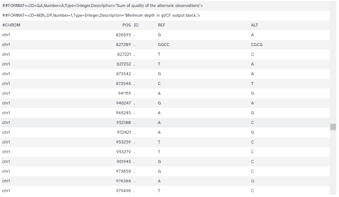

### Context

Minor allele variant analysis is a fundamental component of genomic studies, especially when working with exome sequencing. This project analyzed reads from sample **HG00128** of the 1000 Genomes Project, a female donor of British ancestry.

The goal was to implement a complete variant analysis pipeline starting from **paired-end FASTQ reads**, following NGS standard analysis best practices.

### Objectives

- Evaluate the quality of initial sequencing reads.
- Align sequences to the reference genome (**hg38**).
- Identify Single Nucleotide Variant (SNV) and Indels variants using variant calling tools.
- Functionally annotate the detected variants to infer their biological impact.
- Synthetically present the main results and the analysis limitations.

### Methodology

The analysis was performed entirely on the **Galaxy Europe platform** (usegalaxy.eu), following a standard exome sequencing pipeline:

##### 1. Data loading and preparation

Two paired FASTQ files (read1, read2) were randomly downloaded following the proposed procedure (seed based on the analyst's name). The data was uploaded to an empty Galaxy history to ensure analysis reproducibility.

##### 2. Quality Control

**FASTQC** was applied to each FASTQ file. The report showed:
- Adequate overall quality.
- Some quality drops in the initial/final bases.
- Slight differences between read1 *(left image)* and read2 *(right image)* (typical in paired-end sequencing). 

  
  

Given the goal of a simplified pipeline version, no additional trimming was applied.

##### 3. Alignment to reference genome

Alignment was performed using **BWA-MEM** against the hg38 reference.
Subsequently, the BAM file was sorted using SAMtools sort. Alignment quality was assessed using Samtools idxstats, resulting in:
- A high number of reads correctly assigned to the main chromosomes.
- Presence of reads assigned to alternative contigs (e.g., chrUn”, “_alt”), common in hg38.

Alignment quality was considered acceptable.

Furthermore, the alignment file was visualized using the Integrated Genome Browser (IGB), allowing examination of specific regions, coverage, and discrepancies.

##### 4. Variant identification

**FreeBayes** was applied, selecting the simple diploid calling mode with filtering by quality and coverage. The result was a VCF file, containing:
- The detected variants (SNVs and small indels).
- Their genomic position, alternate alleles and quality/filter information.
- Basic annotations included in the INFO field.

##### 5. Functional annotation

The obtained variants were annotated using **SnpEff**, which provides:
- Prediction of the effect on genes and proteins.
- Classification by impact (High, Moderate, Low, Modifier).
- Functional classes in coding regions (missense, silent, nonsense, etc.).

Both an HTML report and a textual summary were generated.

  
  
  
  

### Results and interpretation

The analysis produced:
- A large set of variants, as is typical in exome sequencing.
- A **high proportion of SNVs** compared to INDELs, consistent with human variability.
- A predominance of variants classified as **"Modifier"**, which usually correspond to non-coding regions or mild effects.
- A smaller fraction of variants with High or Moderate impact.

In the functional classification, **missense** variants represented the most frequent coding category, followed by silent variants, which aligns with the expected pattern for an individual without a known pathological phenotype.

### Limitations

- The analysis used a reduced fragment of the original sample, resulting in non-uniform coverage across the entire exome.
- Concordance with up-to-date databases of known variants was not exhaustively evaluated.
- Phenotypic information about the donor is unavailable, which limits clinical interpretation.
- The presence of alternative contigs is common in hg38 and requires caution when interpreting specific regions.

### Conclusions
This project successfully implemented a complete variant analysis pipeline, applying widely used bioinformatics tools:
- Quality control with FASTQC.
- Alignment with BWA-MEM.
- Assessment with Samtools.
- Variant calling with FreeBayes.
- Annotation with SnpEff.
- Visualization using IGB.