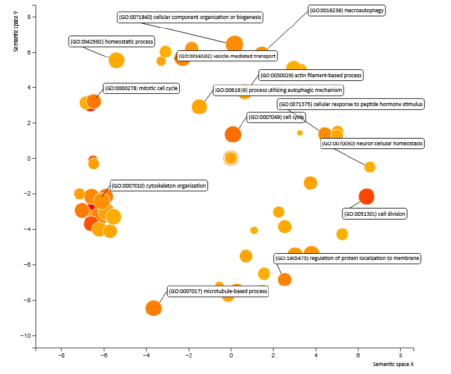

### Context
This project addresses the analysis of RNA-seq data from the study by McClain et al. (GEO: GSE161731), which includes peripheral blood samples from individuals with COVID-19, bacterial infections, and healthy controls.

The primary objective was to perform a complete differential expression analysis pipeline to identify the genes and biological processes involved in the specific response to COVID-19.

### Objectives

- Process and explore an RNA-seq dataset corresponding to three cohorts: *Healthy*, *Bacterial*, and *COVID-19*.
- Identify potential confounding variables that could affect gene expression.
- Detect differentially expressed genes (DEGs) in the contrasts *Bacterial* vs *Healthy* and *COVID-19* vs *Healthy*.
- Biologically interpret the results through functional enrichment analysis.

### Methodology

The analysis was developed entirely in R using packages from the Bioconductor ecosystem.

##### 1. Data acquisition and preparation

The count matrix and metadata were downloaded from GEO. After reviewing the dataset's integrity, duplicates per individual were removed, and clinical variables (age, race, cohort, and batch) were homogenized.
Subsequently, 75 samples were randomly selected. A **SummarizedExperiment** object was constructed, integrating:
- The cleaned count matrix.
- The tidy metadata.
- Gene annotations retrieved using EnsDb.Hsapiens.v113.

##### 2. Filtering, normalization and transformation

Low-expression genes were removed as they are not biologically relevant, and both normalized measures and logarithmic transformations adapted for voom analysis were applied.

##### 3. Exploratory analysis

A **Principal Component Analysis (PCA)** was performed on the transformed data. The PCA revealed:
- A clear separation among cohorts: *Healthy*, *Bacterial*, and *COVID-19* (top left image).
- A strong correlation between cohort and race, where *Bacterial* individuals were predominantly African American, and the other groups were mostly white (top right image).
- Significant differences in age distribution among cohorts, with *Bacterial* individuals being the oldest, followed by *Healthy* and *COVID-19* (bottom left and right images).
- Absence of a batch effect.
- Absence of relevant outliers.

  
  
  
  

Subsequently, a heatmap of the 500 most variable genes was generated, where hierarchical clustering confirmed the segregation observed in the PCA. 

In view of these results, **race** and **age** were identified as variables that must be included in the differential analysis design matrix to control for their effect and isolate the pure infection response.

##### 4. Differential expression analysis

The **limma-voom** method, widely used in RNA-seq analysis with linear models, was applied for differential expression analysis.
The procedure consisted of:
- Voom transformation to stabilize variance (top left image).
- Adjustment of a linear model incorporating cohorts and covariates (age and race).
- Definition of contrasts:
    - *Bacterial* vs *Healthy*.
    - *COVID-19* vs *Healthy*.
- Correction for multiple comparisons using FDR.
The observed trends were:
- A notably larger and broader transcriptomic change in the *Bacterial* vs *Healthy* comparison (top right image).
- A more moderate response in *COVID-19* vs *Healthy* (bottom left image).
- Reduced overlap between both DEG lists (bottom right image).
- Coherence in the direction of regulation for shared genes.

  
  
  
  

##### 5. Functional analysis

An over-representation analysis (Gene Ontology – Biological Process) was performed on the genes overexpressed in COVID-19 compared to healthy controls, employing *topGO*.
The resulting terms were visualized using **REVIGO** to facilitate interpretation.
The most prominent functional processes included:
- Cell cycle
- Cytoskeleton organization
- Mitosis regulation
- Chromosomal dynamics

These results point to mechanisms related to cellular reorganization and proliferation commonly observed in responses to viral infections.

### Results and interpretation
The exploratory analysis allowed for the identification of clear expression patterns that differentiated the three cohorts.
Differential analysis showed an intense and broad response in bacterial infections, while the *COVID-19* response was more subtle and specific.
Functional analysis indicated that *COVID-19*-associated genes related to cell cycle and cellular structure regulatory processes, which is consistent with known immune response mechanisms against viruses.

### Conclusions

This project allowed for the application of a complete transcriptomic analysis pipeline, from data integration and cleaning to the functional interpretation of results. Competencies were developed in:
- Construction and management of SummarizedExperiment objects.
- Quality control and normalization of RNA-seq data.
- Exploratory analysis using PCA, clustering, and heatmaps.
- Differential expression analysis with limma-voom.
- Functional analysis using topGO and REVIGO.
