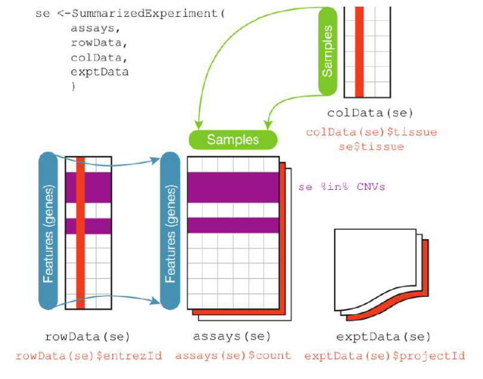
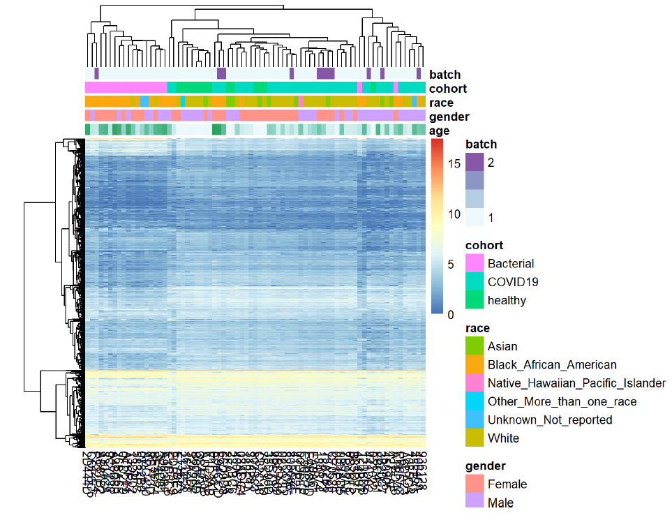

### Context
This project addresses the analysis of RNA-seq data from the study by McClain et al. (GEO: GSE161731), which includes peripheral blood samples from individuals with COVID-19, bacterial infections, and healthy controls.

The primary objective was to perform a complete differential expression analysis pipeline to identify the genes and biological processes involved in the specific response to COVID-19.

### Objectives

- Process and explore an RNA-seq dataset corresponding to three cohorts: *Healthy*, *Bacterial*, and *COVID-19*.
- Identify potential confounding variables that could affect gene expression.
- Detect differentially expressed genes (DEGs) in the contrasts *Bacterial* vs *Healthy* and *COVID-19* vs *Healthy*.
- Biologically interpret the results through functional enrichment analysis.

### Methodology

The analysis was developed entirely in R using packages from the Bioconductor ecosystem.

##### 1. Data acquisition and preparation

The count matrix and metadata were downloaded from GEO. After reviewing the dataset's integrity, duplicates per individual were removed, and clinical variables (age, race, cohort, and batch) were homogenized.
Subsequently, 75 samples were randomly selected. A **SummarizedExperiment** object was constructed, integrating:
- The cleaned count matrix.
- The tidy metadata.
- Gene annotations retrieved using EnsDb.Hsapiens.v113.

##### 2. Filtering, normalization and transformation

Low-expression genes were removed as they are not biologically relevant, and both normalized measures and logarithmic transformations adapted for voom analysis were applied.

##### 3. Exploratory analysis

A **Principal Component Analysis (PCA)** was performed on the transformed data. The PCA revealed:
- A clear separation among cohorts: *Healthy*, *Bacterial*, and *COVID-19* (top left image).
- A strong correlation between cohort and race, where *Bacterial* individuals were predominantly African American, and the other groups were mostly white (top right image).
- Significant differences in age distribution among cohorts, with *Bacterial* individuals being the oldest, followed by *Healthy* and *COVID-19* (bottom left and right images).
- Absence of a batch effect.
- Absence of relevant outliers.

  
  
  
  

Subsequently, a heatmap of the 500 most variable genes was generated, where hierarchical clustering confirmed the segregation observed in the PCA. 

In view of these results, **race** and **age** were identified as variables that must be included in the differential analysis design matrix to control for their effect and isolate the pure infection response.